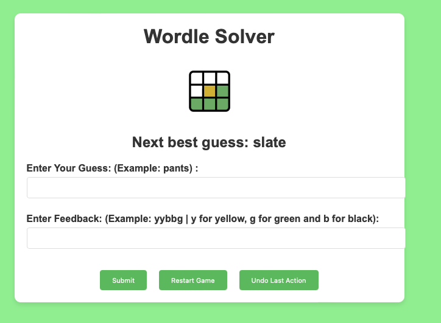

# Wordle Solver
An efficient algorithm designed to crack the Wordle puzzle. This solver applies statistical analysis and pattern detection to make accurate guesses. Quick and easy to use, it's built for anyone looking to master their Wordle game. 

# Wordle Solver

This is a Python-based helper tool designed to assist in solving Wordle puzzles. It uses a combination of word frequency analysis and pattern matching to narrow down possible words with each guess.

## Instructions for Use

1. Clone this repository to your local machine using `git clone` or download the files directly.

2. Navigate to the `woordle-dev` folder.

3. Install the required dependencies by running:

   ```sh
   pip install -r requirements.txt

4. Run the Flask application by executing the following command:
flask run

## UI Screenshot




This README gives users clear instructions on how to set up and play the game with your Wordle solver. You should ensure that all the files required by your solver, such as `possible_answers.txt`, are included in your GitHub repository or provide instructions on how to create or obtain them.
